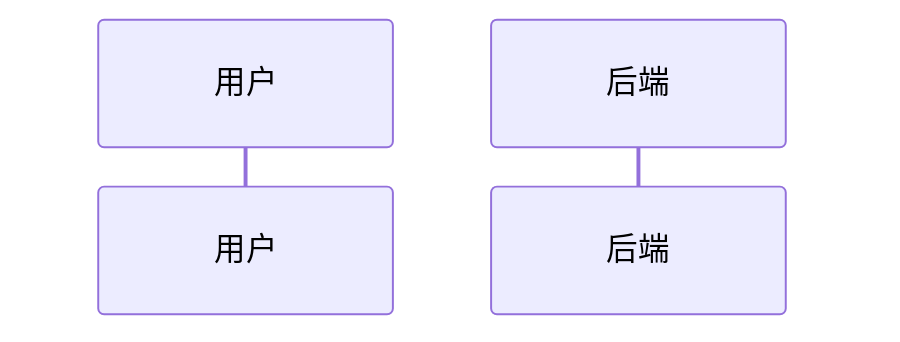
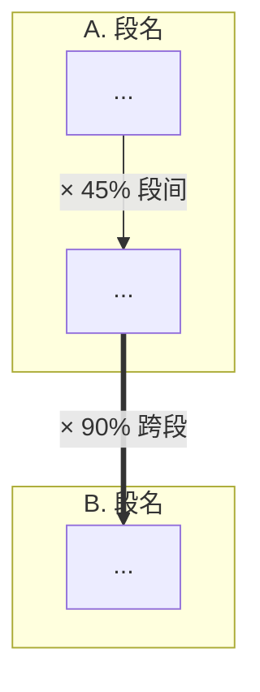

# Mermaid 风格指南（PRD/评审场景专用）

> 工程评审场景的图表审美：**克制、专业、可读**，绝不"花哨"。
> 本指南所有规则都基于实战反馈：matplotlib 圆角渐变箭头版被否，Mermaid 标准渲染版采纳。

---

## 1. 主题与字体（全局配置）

**永远用 `-t neutral` 主题**。默认 `default` 主题带浅蓝/紫渐变，过于花哨。

字体配置（`mermaid-config.json`）：

```json
{
  "theme": "neutral",
  "themeVariables": {
    "fontFamily": "\"Noto Sans CJK SC\", \"Noto Sans\", sans-serif",
    "fontSize": "15px"
  }
}
```

调用：`mmdc -i x.mmd -o x.png -c mermaid-config.json -b white -w 1600`

`-b white` 白底，与文档黑字配色和谐。

---

## 2. 颜色克制原则

**全图 ≤ 3 个 class（颜色组）。** 每多一组颜色，专业感掉一档。

推荐 3 色组：

```mermaid
classDef sectionA fill:#EFF6FF,stroke:#1E40AF,color:#1E3A8A   %% 蓝灰，第一段
classDef sectionB fill:#F5F3FF,stroke:#6D28D9,color:#5B21B6   %% 紫灰，第二段
classDef sectionC fill:#FEF2F2,stroke:#B91C1C,color:#991B1B   %% 红灰，第三段
```

或更克制的单色：

```mermaid
classDef step fill:#FFFFFF,stroke:#4B5563,color:#1F2937       %% 纯白底 + 灰描边
classDef decision fill:#FEF3C7,stroke:#92400E,color:#78350F   %% 黄底，决策点
classDef terminal fill:#D1FAE5,stroke:#065F46,color:#065F46   %% 绿底，终点
```

**禁用**：
- 鲜艳红/黄/橙作为填充（视觉刺眼）
- 渐变填充（Mermaid 不直接支持但有人会用 CSS hack，别这么做）
- 多于 3 个颜色组（评审场景不需要彩虹）

---

## 3. 时序图（sequenceDiagram）规则

### 3.1 必带 `autonumber`



编号让评审者能准确指出"第 5 条消息有问题"。

### 3.2 同步 vs 异步用不同箭头

- `->>` 实线箭头：同步调用 / 主动请求
- `-->>` 虚线箭头：响应 / 返回
- `-)`  开放箭头：异步通知 / fire-and-forget

不要混用乱用。

### 3.3 并行用 `par...and...end`，不用 Note 模拟

```mermaid
par 视频加载与 LLM 生成并行
    U->>U: 视频加载
and
    U->>LLM: 触发生成
end
```

这是表达并行的标准语法。用 Note 模拟会让评审误以为是串行。

### 3.4 关键节点用 `Note over`

```mermaid
Note over U: T0 用户点击「开始课程」
Note over U,API: 关键决策时刻 / 时间锚点
```

`Note over A`：单角色注释
`Note over A,B`：跨角色注释（盖在多个 lifeline 上）
`Note right of A`：放角色右侧的说明

### 3.5 长 label 用 `<br/>` 换行

```mermaid
U->>API: 触发请求<br/>含用户 ID + 历史数据
```

---

## 4. 流程图（flowchart）规则

### 4.1 方向选择

- `flowchart TD`：自上而下（最常用，适合步骤流程）
- `flowchart LR`：从左到右（适合横向决策树）
- `flowchart TB` = `TD`，同义

### 4.2 节点形状语义

| 形状 | 语法 | 用途 |
|------|------|------|
| 矩形 | `S1["..."]` | 普通步骤 |
| 圆角矩形 | `S1(["..."])` | 起点 / 终点 |
| 菱形 | `S3{"..."}` | 决策（用户选择 / 条件判断） |
| 圆形 | `S1(("..."))` | 节点强调（少用） |
| 平行四边形 | `S1[/"..."/]` | 输入输出 |
| 六边形 | `S1{{"..."}}` | 准备 / 检查 |

PRD 评审场景**只用矩形 + 菱形 + 圆角终点**三种，其他形状会让图变复杂。

### 4.3 箭头类型

- `-->` 主流程
- `==>` 加粗箭头：跨段或关键节点
- `-.->` 虚线箭头：可选 / 跳过 / 备用路径
- `-- "label" -->` 带文字箭头

### 4.4 决策菱形的转移语法

```mermaid
S3{"确认选择？"}
S3 -- "[确认]" --> S4
S3 -- "[重选]" --> S2
```

label 加 `[...]` 表示是用户操作（按钮），而非系统判断。

### 4.5 模板变量陷阱

label 里不能有 `{var}` —— `{}` 是菱形保留字。

```
✗ S1["选择 {coach_name} 教练？"]
✓ S1["选择 [coach_name] 教练？"]
✓ S1["选择 &#123;coach_name&#125; 教练？"]
```

---

## 5. 漏斗规则

Mermaid 无原生漏斗类型，用 `flowchart TD + subgraph` 模拟：



**关键**：
- 每个 subgraph 用 `direction TB` 强制纵向（默认横向会变怪）
- 段内用 `-->` 普通箭头
- 跨段用 `==>` 加粗（视觉强调"过段"是关键转化）
- 段间转化率写在箭头 label 里，例：`-->|"× 90%"|`
- 每个节点 label 里 `<b>累计 X%</b>` 加粗标累计数字

---

## 6. 渲染检查清单

每张图渲染后过一遍：

- [ ] 文字有无遮挡 / 溢出节点框？
- [ ] 颜色组数 ≤ 3？
- [ ] 箭头方向语义对（实线/虚线/加粗用对）？
- [ ] 节点 label 完整，没有截断？
- [ ] 关键决策点用菱形？
- [ ] 时序图有 `autonumber`？
- [ ] 跨段 / 跳过路径用了虚线或加粗箭头？
- [ ] 字体是 Noto Sans CJK SC（不是 JP 或默认）？

---

## 7. 反模式速查

| 反模式 | 正确做法 |
|--------|---------|
| 用 matplotlib FancyBboxPatch 手画流程 | 用 Mermaid `flowchart` |
| `-t default` 主题（浅蓝紫渐变） | `-t neutral` |
| 全图 5+ 个颜色 | 全图 ≤ 3 个 class |
| 用 Note 模拟并行 | 用 `par...and...end` |
| sequenceDiagram 无 `autonumber` | 必加 `autonumber` |
| label 里写 `{var}` | 改 `[var]` 或 HTML entity |
| 中文换行用 `\n` | 用 `<br/>` |
| 节点 ID 含空格 / 横线 | 用驼峰或下划线 |
| 漏斗用横向 subgraph | `direction TB` 强制纵向 |
| 段内段间用同一种箭头 | 段内 `-->` 段间 `==>` |
